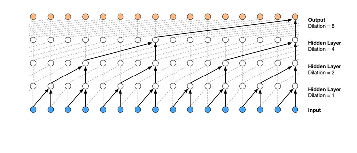
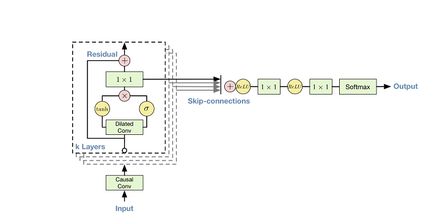
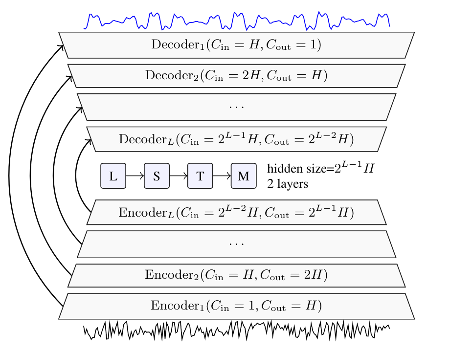
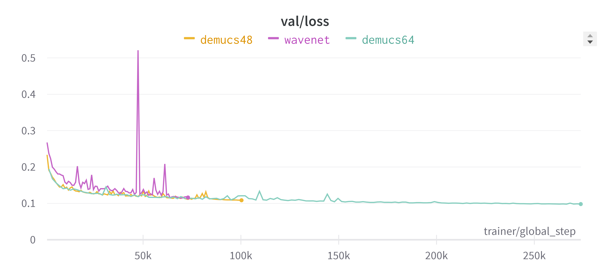

# denoiser

## Структура репозитория
```
.
├───docker
│      Dockerfile
├── assets - изображения для README.md
│   ├── demucs.png
│   ├── validation_loss.png
│   ├── wavenet.png
│   └── wavenet_dataflow.png
├── ml
│   ├── __init__.py
│   ├── configs - файлы конфигурации для обучения моделей
│   │   ├── demucs48.yaml
│   │   ├── demucs64.yaml
│   │   └── wavenet.yaml
│   ├── data.py - работа с звуковыми наборами данных 
│   ├── loss.py - код функции потерь(multi-window STFT + L1 loss)
│   ├── models
│   │   ├── __init__.py
│   │   ├── demucs.py - код архиктектуры Demucs 
│   │   ├── functional.py - функции, необходимые для работы Wavenet
│   │   ├── utils.py 
│   │   ├── wavenet.py - код архиктектуры Wavenet 
│   │   └── wrapper.py - обертка для кода обучения/инференса в pytorch-lightning
│   ├── pipeline.py - полный(пред/пост обработка и инференс) пайплайн для работы с моделями 
│   ├── utils.py
│   └── weights - обученные веса моделей
│       ├── demucs48.pt
│       ├── demucs64.pt
│       └── wavenet.pt
│── web - gradio web-приложение
│   ├── __init__.py
│   ├── app.py - код инициализация приложения
│   ├── config.yaml - конфиг web-приложения
│   └── static
│       ├── script.js
│       └── style.css
├── requirements.txt - зависимости приложения
├── run.py - запуск web-приложения
└─── train.py - запуск процесса обучения
```


## Архитектуры нейронных сетей
В рамках данного проекта были использованны 2 архитектуры нейронных сетей типа encoder-decoder: [Wavenet](https://arxiv.org/pdf/1609.03499v2.pdf) и [Demucs](https://arxiv.org/pdf/1909.01174.pdf)(двух вариаций demucs48 и demucs64).
### Wavenet
Сверточная нейронная сеть с использованием skip-connections схожая по своей структуре с Unet, однако с условием, что для предсказания значения в момент времени $t_i$ могут применяться лишь значения идущие не позже(т.е. такие $t_j$, что $j \leq i$) - это нужно для исключения жульничества моделью.

<figure style='display: inline-block;'>
  
  <figcaption style='text-align: center;'>Иллюстрация зависимости значений в Wavenet</figcaption>
</figure>

<figure style='display: inline-block; '>
  
  <figcaption style='text-align: center;'>Архитектура Wavenet</figcaption>
</figure>

### Demucs
Сверточная нейронная сеть, схожая с Wavenet, но так же применяющий рекуррентный слой перед декодированием. Изначально разработанная для задачи разделения источников звука, может быть использованна для фильтрации шумов при установке единственного целевого источника.  

<figure style='display: inline-block; '>
  
  <figcaption style='text-align: center;'>Архитектура Demucs</figcaption>
</figure>

## Функция потерь
$\texttt{spectral\_loss}(\hat{y}, y) = \frac{||STFT(\hat{y}) - STFT(y)||_{L_1}}{||STFT(y)||_{L_1}}$

$\texttt{spectral\_convergence\_loss}(\hat{y}, y) = ||\log{STFT(\hat{y})}, \log{STFT(y)}||_{L_1}$

$\texttt{stft\_loss}(\hat{y}, y) = \frac{\texttt{spectral\_loss}(\hat{y}, y) + \texttt{spectral\_convergence\_loss}(\hat{y}, y)}{2}$

$\texttt{l1\_loss}(\hat{y}, y) = ||\hat{y} - y||_{L_1}$

$loss(\hat{y}, y) = \frac{\texttt{l1\_loss}(\hat{y} - y) + \texttt{stft\_loss}(\hat{y}, y)}{2}$
, где STFT(Short-time Fourier transform) - преобразование фурье с примением механизма скользящего окна.
Итоговая функция ошибки состоит из двух частей: $\texttt{l1\_loss}$ - основа функции потерь для общей сходимости, $\texttt{stft\_loss}(\hat{y}, y)$ - применяется для придания частичной инвариантности относительно сдвига выхода модели во времени и выделения дополнительной информации о разхождении величин для лучшей сходимости.

## Оптимизация
В качестве оптимизатора был выбран Adam с параметрами $\beta_1=0.9, \beta_2=0.999, \texttt{weight\_decay}=0$ (данная конфигурация была выбрана на основании [статьи](https://arxiv.org/pdf/2006.12847.pdf), посвящённой фильтрации шума с помощью demucs). Значения для $\texttt{learning\_rate}$ указаны в [файлах конфигурации](ml/configs) соответствующих моделей и были подобраны с использованием метода [LR range test](https://arxiv.org/pdf/1506.01186.pdf).
Так же при обучении применялся [lr scheduler](https://pytorch.org/docs/stable/generated/torch.optim.lr_scheduler.ReduceLROnPlateau.html), уменьщающий значение $lr$, если целевая метрика не улучшается на протяжении нескольких эпох.

## Данные 
### Речь
Для получения чистой речи использовался набор данных [Russian Open Speech To Text (STT/ASR)](https://www.kaggle.com/datasets/tapakah68/audio-dataset), содержащий 118000 записей  от 66 дикторов.
### Шум
Для получения шумов было использованно два набора данных: [UrbanSound8K](https://paperswithcode.com/dataset/urbansound8k-1) и [ESC-50](https://paperswithcode.com/dataset/esc-50).


## Процесс обучения
### График изменения функции потерь
<figure style='display: inline-block; '>
  
</figure>

### Итоговые метрики качества  
1) Signal-to-noise ratio (SNR) - отношение мощности сигнала к мощности шума, меняется в пределах $[0, \infin)$, большее значение считается лучшим.
2) Perceptual Evaluation of Speech Quality (PESQ) - оценка качества голосовой связи, меняется в пределах $[-0.5, 4.5]$, большее значение считается лучшим.
3) Short-Time Objective Intelligibility (STOI) - показатель разборчивости речи, 
меняется в пределах $[0, 1]$, большее значение считается лучшим.

|    Model      |   val/loss    |   SNR         |    PESQ       |   STOI        |   
| ------------- | ------------- | ------------- | ------------- | ------------- |
|  Wavenet      | 0.11615       | 9.636         | 2.752         | 0.9179        |
|  Demucs48     | 0.10852       | 18.758        | 2.684         | 0.9118        |
|  Demucs64     | **0.09806**   | **19.979**    | **3.148**     | **0.9349**    |

## Docker
### Сборка образа
```bash
git clone https://github.com/sleeplessuser/denoiser.git
cd denoiser
docker build -f docker/Dockerfile .
```
### Получение готового образа
```bash
docker pull ghcr.io/sleeplessuser/denoiser:main
```
### Запуск web-приложения
```bash
docker run --rm -it -d [--gpus all] -p 7860:7860 <image> 
```